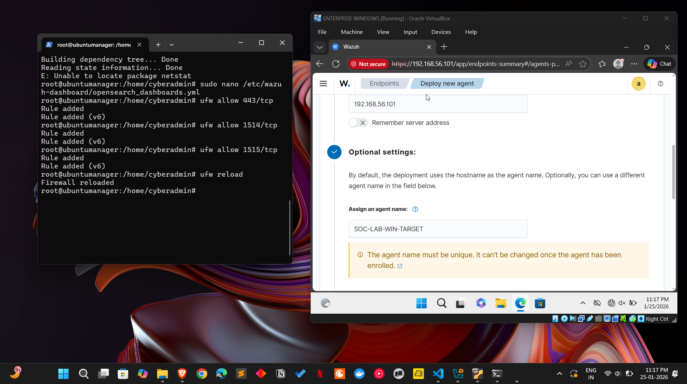

# Engineering an Air-Gapped SOC Lab with Wazuh

There is a massive gap between "Hype-Driven Projects" and "Production-Grade Engineering." Most home lab tutorials suggest a quick NAT-based setup that relies on your home router for everything from DNS to connectivity.

That wasn't enough for me.

I wanted to build a <mark style="color:$danger;">**Secure Enclave**</mark>: a research environment that mimics a corporate VLAN which is isolated from the noise of the public internet, hardened against infrastructure failures, and optimized for high-fidelity threat detection.

***

#### Architect’s Agenda

_To bridge the gap between a "tutorial project" and a "sophisticated lab," I set four non-negotiable engineering requirements for my Day 1 of a major project (I will list it later_ �&#xDE04;_) :_

1. **Network Isolation (The Secure Enclave):** Using a Host-Only private network to ensure zero exposure to the public internet, mimicking the "air-gapped" zones used for critical management servers.
2. **Infrastructure Optimization:** Moving beyond default drivers to implement _<mark style="color:$success;">**Virtio-net paravirtualized**</mark>_ hardware, ensuring the "telemetry pipes" don't burst under the load of high-volume log analysis.
3. **Service Decoupling:** Architecting a multi-tier environment where the Data Layer (Ubuntu Server) is entirely headless, accessed only via a secure Presentation Layer (Host Machine Dashboard).
4. **Tactical Resilience:** Adopting an "investigation mindset" to solve deployment friction from manual `dpkg` package surgery to custom DNS overrides proving that a SOC engineer’s value starts before the first alert even fires.

***

### Resources & Requirements

_I allocated resources based on an Operational-First mindset._

**1. The Hypervisor: Oracle VirtualBox 7.x**

**(I installed the latest -** 7.2.4 version)

* Role: The bedrock of the lab.
* Why: It offers the most granular control over "Host-Only" virtual networking and paravirtualized drivers, which were essential for our infrastructure stability.

**2. The SIEM Manager (The Brain)**

* OS: Ubuntu Server 22.04 LTS (Headless)
* Resources: 2 vCPUs | 4GB RAM | 20GB HDD
* Networking: \* Adapter 1 (NAT): Temporary internet access for package updates.
  * Adapter 2 (Host-Only): The dedicated SOC backbone for agent telemetry.
* Driver: Virtio-net (Paravirtualized) for high-speed, stable data throughput.

**3. The Research Target (The Victim)**

* OS: Windows 10/11 Enterprise
* Resources: 2 vCPUs | 4GB RAM | 40GB HDD
* Networking: Host-Only (Isolated from the internet to prevent "leakage" or external interference).
  * Adapter 2 (NAT): Temporary internet access for agent installation and attack packages.
* Security Stack: Wazuh Agent + Sysmon (Olaf Hartong’s Modular Config) for deep-kernel visibility.

**4. The SOC Workstation (The Presentation Layer)**

* OS: Physical Host (Windows/Mac)
* Role: Managing the lab via SSH and a web browser.
* Why: By separating the dashboard from the VMs, we reduce the resource load on the virtual environment and mimic a real-world remote SOC operation.

> Many students try to run a full GUI on Ubuntu, which eats up 2GB of RAM just for the "desktop." By going Headless (CLI-only), I reclaimed that memory for the Elasticsearch/Indexer engine, ensuring that when we run a Password Spray attack for instance, the SIEM doesn't crash under the log volume.

***

## Phase 1: The Network Blueprint

<figure><figcaption></figcaption></figure>

Most lab setups fail because they rely on the default NAT, which can be noisy and unpredictable. To build a "Secure Enclave," I utilized the VirtualBox Network Manager to create a dedicated communication layer.

### **1. Creating the Host-Only Backbone**

<figure><figcaption></figcaption></figure>

Instead of the standard internet-facing NAT, I initialized a Host-Only Network. This acts as a private "virtual switch" that only my VMs and my host machine can access.

* The Config: I enabled the built-in DHCP Server(you can leave it automatic as well) within VirtualBox to ensure that as soon as a new "victim" or "sensor" joins the lab, it is automatically assigned an IP within our private range (e.g., `192.168.56.x`).
* The Benefit: This creates a stable "Heartbeat" for the SIEM. Even if my physical Wi-Fi drops or I change locations, the internal telemetry between the Windows Target and the Ubuntu Manager remains 100% stable.

### **2. Dual-Homed Architecture for the Manager**

I configured the Ubuntu Manager with two network interfaces:

* Adapter 1 (NAT): A temporary "bridge" to the internet to fetch the Wazuh repository and security updates.
* Adapter 2 (Host-Only): The permanent listening post for agent logs.

### **3. The "Virtio" Stability Pivot**

<figure><figcaption></figcaption></figure>

During initial testing, the standard Intel drivers caused "Reset Adapter" errors under the heavy load of the Wazuh installation.

* The Solution: I pivoted to Paravirtualized Network (Virtio-net) drivers.
* The Engineering Takeaway: This shift significantly increased throughput and eliminated the SSH timeouts that plague most VirtualBox labs. It was a move from "simulated hardware" to "native-speed virtualization."

***

## Phase 2: Headless Ubuntu Engineering

_For the Wazuh Manager, I intentionally chose Ubuntu Server (CLI-only). While a GUI is tempting for beginners, real-world SOC infrastructure is headless to maximize resource efficiency and minimize the attack surface._

_As you understand this, please start your ubuntu machine. There is a need for some configurations._

### **1. Establishing the "Remote Command Center" (SSH)**

<figure><figcaption></figcaption></figure>

To manage the "air-gapped" manager from my host machine, I had to bridge the communication gap.

* The Challenge: Out of the box, Ubuntu Server might not have SSH active or the firewall might block the handshake.
* The Engineering Fix is `ssh`
*   On Ubuntu (Manager): Type `ip a` to find your Host-Only IP (usually `192.168.56.x`).

    &#x20; &#x20;

<mark style="color:$success;">**Ensure the SSH service is installed and alive in the ubuntu vm cli-**</mark>&#x20;

1. `sudo apt install openssh-server -y`&#x20;
2. `sudo systemctl enable --now ssh`

<mark style="color:$success;">**Open the 'gates' in the Uncomplicated Firewall (UFW) in the ubuntu vm cli-**</mark>

1. `sudo ufw allow`&#x20;
2. `ssh sudo ufw allow 443/tcp` # Dashboard access&#x20;
3. `sudo ufw allow 1514/tcp` # Agent communication&#x20;
4. `sudo ufw allow 1515/tcp` # Agent registration&#x20;
5. `sudo ufw enable`

#### 2. Prevent the SSH Timeout

Now you are all done, in your powershell you can now do ssh connection like this 👇🏻

* The "Stay Alive" Hack: Because the Wazuh installation is heavy, the SSH connection would often time out. I modified my connection string on the host machine's PowerShell to keep the tunnel open: `ssh -o ServerAliveInterval=60 cyberadmin@192.168.56.101`
* This tells your Windows machine to send a "Hey, are you still there?" message every 60 seconds, which prevents the connection from being dropped during the long installation.

#### 3. The "Clean Slate" Run

As you are connected via ssh, you can simply run this command to install the wazuh manager packages

```
curl -sO https://packages.wazuh.com/4.10/wazuh-install.sh && sudo bash ./wazuh-install.sh -a
```

The `-a` tells the script to perform an unattended, all-in-one installation. It’s the most stable way to get all three "organs" of the Wazuh brain talking to each other automatically.

<mark style="color:$danger;">**Fixing Corrupted Installs**</mark>

Even with a stable tunnel, network flickers cause the `wazuh-install.sh` script to fail halfway, leaving the system in a "broken" state (Error 127). I had to perform manual surgery on the package manager to get a fresh start:

```
# Removing the 'scar tissue' of the failed install
sudo dpkg --remove --force-remove-reinstreq wazuh-manager
sudo rm /var/lib/dpkg/info/wazuh-manager.*
sudo apt-get purge -y wazuh-manager
```

### **3. Making the Dashboard "Extroverted"**

<figure><figcaption></figcaption></figure>

By default, Wazuh is shy 😅 it only talks to `localhost`. Since I wanted to access the dashboard from my host machine’s browser, I had to modify the configuration to listen on all interfaces.

* The Edit: Navigated to `/etc/wazuh-dashboard/opensearch_dashboards.yml`.
* The Pivot: Changed `server.host: "localhost"` to `server.host: "0.0.0.0"`.
* The Result: This simple change turned a local service into a network-accessible SOC console.


_<mark style="color:yellow;">It’s about managing services (</mark><mark style="color:yellow;">`systemctl`</mark><mark style="color:yellow;">), monitoring daemons, and understanding how configuration files (YAML/JSON) dictate network behavior. When the script finally spat out the Admin Credentials, if there is it means that's a successful troubleshooting. Copy the credentials immediately.</mark>_


Now, please check the status because it's necessary to check if the services are alive&#x20;

```
sudo systemctl status wazuh-manager
sudo systemctl status wazuh-dashboard
```

***

## Phase 3: Provisioning the Windows Endpoint

_To turn a standard Windows OS into a high-fidelity "Research Target," I had to manage a fine balance between internet access for setup and isolation for security. I will list down a catch later on._

**1. The Dual-Adapter Strategy**

Installing a modern Windows OS (GUI) requires access to Microsoft services, but our SOC lab requires isolation. I solved this by using a Dual-Adapter configuration:

* Adapter 1 (Host-Only): The dedicated, air-gapped line for sending security logs to the Ubuntu Manager.
* Adapter 2 (NAT): The temporary "bridge" to the internet for the OS installation and the initial download of the Wazuh MSI package.

**2. Verification via Connectivity (The Ping Test)**

<figure><figcaption></figcaption></figure>

Before installing any security software, I performed a "Handshake Verification." This ensures the virtual wiring is correct.

* The Test: On the Windows VM, I opened the Command Prompt and ran a continuous ping to my Ubuntu Manager: `ping -t 192.168.56.101`
* The Result: Seeing those stable "Reply from..." messages proved that my Secure Enclave was functional. It confirmed that even without the internet (NAT disabled), the Windows machine could still talk to its "Brain."

**3. Overcoming the DNS Barrier**

Even with the NAT adapter active, the Windows VM struggled to resolve `packages.wazuh.com`. If it does it your case. Don't have to do these, I will show you a quick way later on.

* The Engineering Tweak: Manually overrode the DNS settings on the NAT adapter to use Google’s Public DNS (`8.8.8.8`).
* This simple network pivot allows the `Invoke-WebRequest` command to finally pull the Wazuh agent installer, turning the machine from a passive OS into a live security sensor. We need this later on.

As everything is sorted out, you can open the `https://<wazuh-dashboard-ip>` even from your host machine browser, and that's more easy for doing quick configurations 🐳

***

## Phase 4: Sentinel

_With the "Brain" (Ubuntu) stabilized and the "Nervous System" (Networking) verified for sure, it is the time to deploy our first sensor. This phase is the bridge between infrastructure engineering and active security monitoring._

### **1. The Dashboard Handshake**

Accessing the Wazuh Dashboard for the first time is more than just a login; it’s the initialization of the SOC.

<figure><figcaption></figcaption></figure>

* The Navigation: Using my host machine’s browser (or the target windows machine), I navigated to the Ubuntu Host-Only IP. After bypassing the self-signed certificate warning (standard for private labs), I was met with the Wazuh login which is the <mark style="color:yellow;">"Face" of the operation</mark>.
* The First Task: Navigated to Agents > Deploy New Agent.


Might be the case, an error screen might be popping up that screams API errors.&#x20;

<figure><figcaption></figcaption></figure>

We have to make few workarounds for the same, open the ubuntu vm or the ssh window to check which service is actually "down."

```
sudo systemctl status wazuh-indexer
sudo systemctl status wazuh-manager
sudo systemctl status wazuh-dashboard
```

* The common culprit: If `wazuh-indexer` is red (failed), the API will always be down because it can't query the data.

If the services are "active" but the API is still down, it's a synchronization issue. Restart them in this exact order so the database is ready before the manager tries to connect:

```
# 1. Start the Database
sudo systemctl restart wazuh-indexer
sleep 15  # Give it a moment to initialize its ports

# 2. Start the Manager
sudo systemctl restart wazuh-manager
sleep 5

# 3. Start the Dashboard
sudo systemctl restart wazuh-dashboard
```

Since you modified the `0.0.0.0` setting earlier, let's make sure the Manager is actually listening for the API requests. Run

```
sudo netstat -tulnp | grep :9200
```

* You should see a line showing the Indexer is listening. If you don't see anything on port 9200, the indexer hasn't started correctly. (Only if netstat command is installed 😆)

If it still says "API down" after the restart, run this to see the _actual_ error message the dashboard is seeing,&#x20;

```
sudo journalctl -u wazuh-dashboard -f
```

Look for: "Connection refused" or "Authentication error." and again performed the `systemctl restart` commands

### **2. Provisioning the Agent (The Command)**

* Operating System: Windows
* Manager Address: `192.168.56.101` (Our secure Host-Only IP)
* Agent Name: `SOC-LAB-WIN-TARGET`
* The Magic Line: Wazuh generated a specialized Invoke-WebRequest PowerShell command. This command is a "Double-Action" script: it downloads the MSI installer and automatically configures the manager’s IP and the agent’s name in one go.

<mark style="color:$danger;">**May be an error message**</mark><mark style="color:$danger;">**&#x20;**</mark><mark style="color:$danger;">**`The remote name could not be resolved: 'packages.wazuh.com'`**</mark><mark style="color:$danger;">**&#x20;**</mark><mark style="color:$danger;">**come which is a classic symptom of a DNS failure. Even though you have a NAT adapter enabled, your Windows VM is trying to ask a "phonebook" (DNS server) for the IP address of Wazuh, and nobody is answering.**</mark>

For resolving this open your PowerShell (Admin) again. Before running the big command, let's clear the "bad memory" of the failed attempt:

PowerShell

```
ipconfig /flushdns
```

Now, try running your Wazuh installation command again. It should be able to "resolve" the name and start the download immediately.

### <mark style="color:$success;">There is a MORE PROFESSIONAL WAY to do installation of agent, check this for knowledge</mark>

_<mark style="color:$success;">First download the .msi installer in your main host machine with the same configurations we made for our target windows machine</mark>_

This is how we do it in secure corporate environments where servers _never_ touch the internet.

1. On your Host Machine (Windows Laptop): Download the [Wazuh Agent MSI installer](https://www.google.com/search?q=https://packages.wazuh.com/4.x/windows/wazuh-agent-4.10.3-1.msi) directly.
2. The Transfer:
   * Go to VirtualBox Settings > Shared Folders.
   * Add a folder from your laptop (like your Downloads folder).
   * Check Auto-mount.
3. On the Windows VM: Open File Explorer, find the shared folder, and copy the `.msi` to your desktop.
4. Install: Run the `.msi`. When it asks for the Manager IP, type your Ubuntu Host-Only IP.

### **3. Execution on the Target**

Switching to the Windows VM, I executed the command in an Administrative PowerShell terminal.

* The Final Kick: Once the installer finished, I manually started the service to ensure a clean "First Pulse" (write it on powershell of the target windows machine)

```
# Start the Wazuh Service
NET START Wazuh

# Verify it is actually running
Get-Service -Name Wazuh
```

_If it says "Running," the sensor is officially "listening" to your Ubuntu Manager._

#### <mark style="color:$danger;">High-Fidelity Sync (Sysmon)</mark>

<figure><figcaption></figcaption></figure>

1. Open the Config: Navigate to `C:\Program Files (x86)\ossec-agent\ossec.conf` and open it with Notepad (Run as Administrator).
2.  Add Sysmon: Scroll down to the `<ossec_config>` section and paste this block to tell Wazuh to read your Sysmon events:

    ```
    <localfile>
      <location>Microsoft-Windows-Sysmon/Operational</location>
      <log_format>eventchannel</log_format>
    </localfile>
    ```
3. Restart to Apply: `Restart-Service -Name Wazuh`

### **4. Pulse Verification**

<figure><figcaption></figcaption></figure>

A security engineer never assumes, always make sure to verify. I returned to the dashboard to confirm the "Heartbeat" of my new sentinel.

* The "Green" Moment: Seeing the agent status flip from "Never Connected" to Active (Green) was the definitive proof that the Host-Only tunnel was working.
* Telemetry Validation: I navigated to the Discover tab and filtered for my agent. Seeing the raw JSON logs flowing in Security events, System logs, and most importantly, Sysmon telemetry confirmed that the data pipeline was healthy. (This will come with exploration)&#x20;

***

It was a mission to build a resilient, air-gapped security enclave from the ground. By moving past 'next-next-finish' tutorials and tackling the raw friction of paravirtualized drivers, manual package surgery, and isolated network routing, I’ve established a foundation that mimics a true enterprise environment. This isn’t just a lab, it’s a high-fidelity telemetry pipeline where every packet and process is visible.

The infrastructure is hardened, the 'Brain' is alive, and the sentinel is active. While Day 1 proved I can build the fortress, Day 2 is where we test its walls.&#x20;

The stage is set for a deep-dive into Windows attack simulations, where we move from the role of the Architect to the role of the Hunter, but before that being an engineer in itself.&#x20;

Stay tuned 🚀


